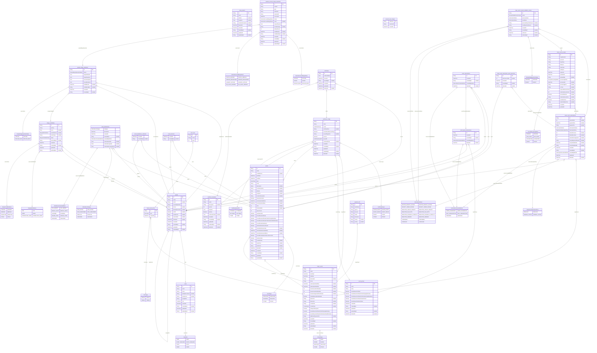

# Esquema

{/* Diagrama gerado automaticamente com base nos arquivos Prisma em apps/backend/prisma/schema. Não altere manualmente o bloco Mermaid abaixo. */}

```mermaid

erDiagram

        AttendanceCreationMethod {
            CSV_IMPORT CSV_IMPORT
MANUAL_INPUT MANUAL_INPUT
SCANNER SCANNER
ONLINE_CODE ONLINE_CODE
UNKNOWN UNKNOWN
        }
    


        AttendanceCategory {
            NON_PAYING NON_PAYING
NON_SUBSCRIBED NON_SUBSCRIBED
REGULAR REGULAR
UNKNOWN UNKNOWN
        }
    


        CertificateScope {
            MAJOR_EVENT MAJOR_EVENT
EVENT_GROUP EVENT_GROUP
EVENT EVENT
OTHER OTHER
        }
    


        CertificateIssuedTo {
            ATTENDEE ATTENDEE
LECTURER LECTURER
OTHER OTHER
        }
    


        EventType {
            MINICURSO MINICURSO
PALESTRA PALESTRA
OTHER OTHER
        }
    


        ReceiptValidationActionType {
            APPROVE APPROVE
REJECT REJECT
        }
    


        ReceiptProcessingStatus {
            PENDING PENDING
OCR_DONE OCR_DONE
CONVERTED CONVERTED
FAILED FAILED
        }
    


        PriceType {
            SINGLE SINGLE
TIERED TIERED
        }
    


        MergeCandidateStatus {
            PENDING PENDING
MERGED MERGED
REJECTED REJECTED
STALE STALE
        }
    


        MergeMatchMethod {
            CPF CPF
EMAIL EMAIL
NORMALIZED_NAME NORMALIZED_NAME
        }
    


        PeopleMergeOperationStatus {
            APPLIED APPLIED
ROLLED_BACK ROLLED_BACK
        }
    


        SubscriptionStatus {
            WAITING_RECEIPT_UPLOAD WAITING_RECEIPT_UPLOAD
RECEIPT_UNDER_REVIEW RECEIPT_UNDER_REVIEW
REJECTED_INVALID_RECEIPT REJECTED_INVALID_RECEIPT
REJECTED_NO_SLOTS REJECTED_NO_SLOTS
REJECTED_SCHEDULE_CONFLICT REJECTED_SCHEDULE_CONFLICT
REJECTED_GENERIC REJECTED_GENERIC
CONFIRMED CONFIRMED
CANCELED CANCELED
        }
    


        SubscriptionCreationMethod {
            ADMIN_DASHBOARD ADMIN_DASHBOARD
SELF_SUBSCRIPTION SELF_SUBSCRIPTION
UNKNOWN UNKNOWN
        }
    


        MajorEventSubscriptionFlow {
            REGULAR REGULAR
RANKED_VOTING RANKED_VOTING
        }
    


        UserRole {
            USER USER
EVENT_MANAGER EVENT_MANAGER
CACIC CACIC
ADMIN ADMIN
        }
    


        ContactType {
            EMAIL EMAIL
PHONE PHONE
WHATSAPP WHATSAPP
OTHER OTHER
        }
    


        ExternalAccountMergeStatus {
            APPLIED APPLIED
FAILED FAILED
ROLLED_BACK ROLLED_BACK
        }
    


        ExternalAccountMergeResult {
            PEOPLE_MERGED PEOPLE_MERGED
PERSON_REASSIGNED PERSON_REASSIGNED
ALREADY_APPLIED ALREADY_APPLIED
NO_LOCAL_PERSON NO_LOCAL_PERSON
        }
    
  "event_attendances" {
    AttendanceCategory category 
    DateTime attendedAt 
    DateTime createdAt 
    String createdById "nullable"
    AttendanceCreationMethod createdByMethod 
    Float collectedLatitude "nullable"
    Float collectedLongitude "nullable"
    Float collectedAccuracyMeters "nullable"
    }
  

  "event_attendance_collectors" {
    DateTime createdAt 
    String createdById "nullable"
    }
  

  "certificate_templates" {
    String id "PK"
    String name 
    String description "nullable"
    Int version 
    Json template 
    Boolean isActive 
    Json certificateFields "nullable"
    DateTime createdAt 
    String createdById "nullable"
    DateTime updatedAt 
    String updatedById "nullable"
    DateTime deletedAt "nullable"
    }
  

  "certificate_configs" {
    String id "PK"
    String name 
    CertificateScope scope 
    String certificateText "nullable"
    Boolean shouldAutofillSecondPage 
    String secondPageText "nullable"
    Boolean isActive 
    CertificateIssuedTo issuedTo 
    Json certificateFields "nullable"
    DateTime createdAt 
    String createdById "nullable"
    DateTime updatedAt 
    String updatedById "nullable"
    DateTime deletedAt "nullable"
    }
  

  "certificates" {
    String id "PK"
    Json renderedData 
    DateTime issuedAt 
    String issuedById "nullable"
    DateTime createdAt 
    DateTime updatedAt 
    DateTime deletedAt "nullable"
    }
  

  "event_groups" {
    String id "PK"
    String name 
    String emoji 
    Boolean shouldIssueCertificate 
    Boolean shouldIssueCertificateForNonPayingAttendees 
    Boolean shouldIssueCertificateForNonSubscribedAttendees 
    Boolean shouldIssueCertificateForEachEvent 
    Boolean shouldIssuePartialCertificate 
    DateTime createdAt 
    String createdById "nullable"
    DateTime updatedAt 
    String updatedById "nullable"
    DateTime deletedAt "nullable"
    }
  

  "events" {
    String id "PK"
    String name 
    Int creditMinutes "nullable"
    DateTime startDate 
    DateTime endDate 
    EventType type 
    String emoji 
    String description "nullable"
    String shortDescription "nullable"
    Float latitude "nullable"
    Float longitude "nullable"
    String locationDescription "nullable"
    Boolean allowSubscription 
    DateTime subscriptionStartDate "nullable"
    DateTime subscriptionEndDate "nullable"
    Int slots "nullable"
    Int slotsAvailable "nullable"
    Int queueCount 
    Boolean autoSubscribe 
    Boolean shouldIssueCertificate 
    Boolean shouldIssueCertificateForNonPayingAttendees 
    Boolean shouldIssueCertificateForNonSubscribedAttendees 
    Boolean shouldCollectAttendance 
    Boolean isOnlineAttendanceAllowed 
    String onlineAttendanceCode "nullable"
    DateTime onlineAttendanceStartDate "nullable"
    DateTime onlineAttendanceEndDate "nullable"
    Boolean shouldProvideSubscriberListToLecturer 
    Boolean publiclyVisible 
    String youtubeCode "nullable"
    String buttonText "nullable"
    String buttonLink "nullable"
    DateTime deletedAt "nullable"
    DateTime createdAt 
    String createdById "nullable"
    DateTime updatedAt 
    String updatedById "nullable"
    }
  

  "place_presets" {
    String id "PK"
    String name 
    Float latitude "nullable"
    Float longitude "nullable"
    String locationDescription "nullable"
    DateTime deletedAt "nullable"
    DateTime createdAt 
    String createdById "nullable"
    DateTime updatedAt 
    String updatedById "nullable"
    }
  

  "event_lecturers" {
    DateTime createdAt 
    String createdById "nullable"
    }
  

  "major_events" {
    String id "PK"
    String name 
    DateTime startDate 
    DateTime endDate 
    String description "nullable"
    String emoji 
    DateTime subscriptionStartDate "nullable"
    DateTime subscriptionEndDate "nullable"
    Int maxCoursesPerAttendee "nullable"
    Int maxLecturesPerAttendee "nullable"
    Int maxUncategorizedPerAttendee "nullable"
    Boolean rankedSubscriptionEnabled 
    String buttonText "nullable"
    String buttonLink "nullable"
    String contactInfo "nullable"
    ContactType contactType "nullable"
    Boolean isPaymentRequired 
    Boolean shouldIssueCertificateForNonPayingAttendees 
    Boolean shouldIssueCertificateForNonSubscribedAttendees 
    String additionalPaymentInfo "nullable"
    DateTime createdAt 
    String createdById "nullable"
    DateTime updatedAt 
    String updatedById "nullable"
    DateTime deletedAt "nullable"
    }
  

  "payment_info" {
    String id "PK"
    String bankName 
    String agency 
    String account 
    String holder 
    String document 
    String pixKey "nullable"
    String pixCity "nullable"
    }
  

  "major_event_receipts" {
    String id "PK"
    String majorEventId 
    String personId 
    String objectKey 
    String fileName 
    String mimeType 
    Int sizeBytes 
    DateTime expiresAt 
    DateTime uploadedAt 
    String uploadedBy "nullable"
    ReceiptProcessingStatus processingStatus 
    DateTime processedAt "nullable"
    String processingError "nullable"
    String ocrText "nullable"
    Int expectedAmountCents "nullable"
    Int matchedAmountCents "nullable"
    Boolean amountMatched "nullable"
    String matchedAmountText "nullable"
    Boolean nameMatched "nullable"
    String matchedNameText "nullable"
    DateTime createdAt 
    DateTime updatedAt 
    }
  

  "major_event_receipt_validation_actions" {
    String id "PK"
    ReceiptValidationActionType action 
    SubscriptionStatus previousStatus 
    SubscriptionStatus nextStatus 
    String previousRejectionReason "nullable"
    String nextRejectionReason "nullable"
    DateTime createdAt 
    String createdById "nullable"
    DateTime undoneAt "nullable"
    String undoneById "nullable"
    }
  

  "major_event_prices" {
    String id "PK"
    PriceType type 
    DateTime createdAt 
    }
  

  "price_tiers" {
    String id "PK"
    String name 
    Int value 
    }
  

  "people_merge_operations" {
    String id "PK"
    PeopleMergeOperationStatus status 
    Json migratedFields 
    Json targetSnapshot 
    Json sourceSnapshot 
    Json movedRelations 
    DateTime rolledBackAt "nullable"
    String rolledBackById "nullable"
    DateTime createdAt 
    String createdById "nullable"
    }
  

  "merge_candidates" {
    String id "PK"
    String pairKey 
    Float score "nullable"
    MergeMatchMethod matchMethod "nullable"
    String matchValue "nullable"
    MergeCandidateStatus status 
    String resolvedById "nullable"
    DateTime createdAt 
    String createdById "nullable"
    DateTime updatedAt 
    String updatedById "nullable"
    }
  

  "people" {
    String id "PK"
    String name 
    String email "nullable"
    String secondaryEmails 
    String phone "nullable"
    String identityDocument "nullable"
    Boolean isCPF "nullable"
    String academicId "nullable"
    String externalRef "nullable"
    DateTime deletedAt "nullable"
    DateTime createdAt 
    String createdById "nullable"
    DateTime updatedAt 
    String updatedById "nullable"
    }
  

  "event_subscriptions" {
    String id "PK"
    DateTime createdAt 
    String createdById "nullable"
    SubscriptionCreationMethod createdByMethod 
    DateTime deletedAt "nullable"
    }
  

  "event_group_subscriptions" {
    String id "PK"
    DateTime createdAt 
    String createdById "nullable"
    SubscriptionCreationMethod createdByMethod 
    DateTime deletedAt "nullable"
    }
  

  "major_event_subscriptions" {
    String id "PK"
    Int amountPaid "nullable"
    DateTime paymentDate "nullable"
    String paymentTier "nullable"
    SubscriptionStatus subscriptionStatus 
    MajorEventSubscriptionFlow subscriptionFlow 
    Int desiredCourses "nullable"
    Int desiredLectures "nullable"
    Int desiredUncategorized "nullable"
    String receiptRejectionReason "nullable"
    DateTime receiptValidatedAt "nullable"
    String receiptValidatedBy "nullable"
    DateTime createdAt 
    String createdById "nullable"
    SubscriptionCreationMethod createdByMethod 
    DateTime updatedAt 
    DateTime deletedAt "nullable"
    }
  

  "major_event_subscription_event_selections" {
    String id "PK"
    Int preferenceOrder "nullable"
    DateTime createdAt 
    String createdById "nullable"
    DateTime deletedAt "nullable"
    }
  

  "users" {
    String id "PK"
    String email 
    String name 
    String identityDocument "nullable"
    String academicId "nullable"
    String unespRole 
    UserRole role 
    DateTime createdAt 
    String createdById "nullable"
    DateTime updatedAt 
    String updatedById "nullable"
    }
  

  "account_user_merges" {
    String oldUserId "PK"
    String newUserId 
    DateTime createdAt 
    }
  

  "external_account_merge_operations" {
    String id "PK"
    String eventId 
    String type 
    String oldUserId 
    String newUserId 
    DateTime occurredAt 
    ExternalAccountMergeStatus status 
    ExternalAccountMergeResult result "nullable"
    Json requestPayload 
    String errorMessage "nullable"
    Int attemptCount 
    DateTime rolledBackAt "nullable"
    String rolledBackById "nullable"
    DateTime createdAt 
    String createdById "nullable"
    DateTime updatedAt 
    String updatedById "nullable"
    }
  
    "event_attendances" }o--|| people : "person"
    "event_attendances" }o--|| events : "event"
    "event_attendances" |o--|| "AttendanceCategory" : "enum:category"
    "event_attendances" |o--|| "AttendanceCreationMethod" : "enum:createdByMethod"
    "event_attendance_collectors" }o--|| events : "event"
    "event_attendance_collectors" }o--|| people : "person"
    "certificate_configs" |o--|| "CertificateScope" : "enum:scope"
    "certificate_configs" }o--|o major_events : "majorEvent"
    "certificate_configs" }o--|o event_groups : "eventGroup"
    "certificate_configs" }o--|o events : "event"
    "certificate_configs" }o--|| certificate_templates : "certificateTemplate"
    "certificate_configs" |o--|| "CertificateIssuedTo" : "enum:issuedTo"
    "certificates" }o--|| people : "person"
    "certificates" }o--|| certificate_configs : "config"
    "certificates" }o--|| certificate_templates : "certificateTemplate"
    "events" |o--|| "EventType" : "enum:type"
    "events" }o--|o major_events : "majorEvent"
    "events" }o--|o event_groups : "eventGroup"
    "event_lecturers" }o--|| events : "event"
    "event_lecturers" }o--|| people : "person"
    "major_events" |o--|o "ContactType" : "enum:contactType"
    "payment_info" |o--|| major_events : "majorEvent"
    "major_event_receipts" }o--|| major_event_subscriptions : "subscription"
    "major_event_receipts" |o--|| "ReceiptProcessingStatus" : "enum:processingStatus"
    "major_event_receipt_validation_actions" }o--|| major_event_subscriptions : "subscription"
    "major_event_receipt_validation_actions" }o--|o major_event_receipts : "receipt"
    "major_event_receipt_validation_actions" |o--|| "ReceiptValidationActionType" : "enum:action"
    "major_event_receipt_validation_actions" |o--|| "SubscriptionStatus" : "enum:previousStatus"
    "major_event_receipt_validation_actions" |o--|| "SubscriptionStatus" : "enum:nextStatus"
    "major_event_prices" }o--|| major_events : "majorEvent"
    "major_event_prices" |o--|| "PriceType" : "enum:type"
    "price_tiers" }o--|| major_event_prices : "price"
    "people_merge_operations" }o--|| people : "targetPerson"
    "people_merge_operations" }o--|| people : "sourcePerson"
    "people_merge_operations" }o--|o merge_candidates : "mergeCandidate"
    "people_merge_operations" |o--|| "PeopleMergeOperationStatus" : "enum:status"
    "merge_candidates" }o--|| people : "personA"
    "merge_candidates" }o--|| people : "personB"
    "merge_candidates" |o--|o "MergeMatchMethod" : "enum:matchMethod"
    "merge_candidates" |o--|| "MergeCandidateStatus" : "enum:status"
    "people" }o--|o users : "user"
    "people" |o--|o people : "mergedInto"
    "event_subscriptions" }o--|| events : "event"
    "event_subscriptions" }o--|| people : "person"
    "event_subscriptions" }o--|o event_group_subscriptions : "eventGroupSubscription"
    "event_subscriptions" |o--|| "SubscriptionCreationMethod" : "enum:createdByMethod"
    "event_group_subscriptions" }o--|| event_groups : "eventGroup"
    "event_group_subscriptions" }o--|| people : "person"
    "event_group_subscriptions" |o--|| "SubscriptionCreationMethod" : "enum:createdByMethod"
    "major_event_subscriptions" }o--|| major_events : "majorEvent"
    "major_event_subscriptions" }o--|| people : "person"
    "major_event_subscriptions" |o--|| "SubscriptionStatus" : "enum:subscriptionStatus"
    "major_event_subscriptions" |o--|| "MajorEventSubscriptionFlow" : "enum:subscriptionFlow"
    "major_event_subscriptions" |o--|| "SubscriptionCreationMethod" : "enum:createdByMethod"
    "major_event_subscription_event_selections" }o--|| major_event_subscriptions : "subscription"
    "major_event_subscription_event_selections" }o--|| events : "event"
    "users" |o--|| "UserRole" : "enum:role"
    "external_account_merge_operations" |o--|| "ExternalAccountMergeStatus" : "enum:status"
    "external_account_merge_operations" |o--|o "ExternalAccountMergeResult" : "enum:result"
    "external_account_merge_operations" }o--|o people_merge_operations : "peopleMergeOperation"

```
